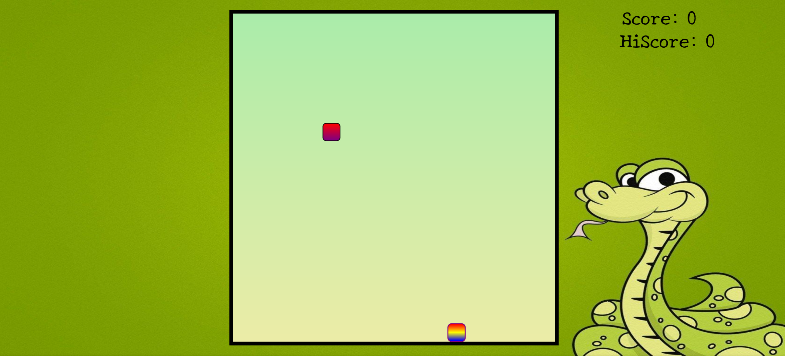
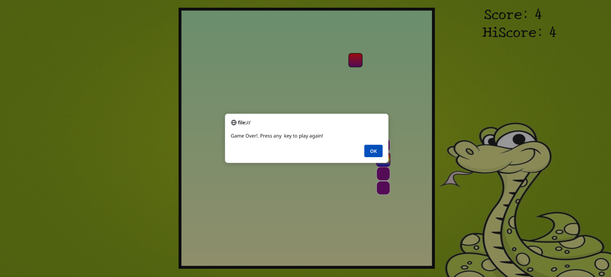

# The Snake Game

A classic snake game which can be played comfortably on web browser

## Features

- A soft arcade game background music keeps playing as long as the game is not over.
- For every apple consumed, a short music plays.
- If the game is over then a game-over music triggers.
- The score is reset for the next game to begin, but then a highscore count is still maintained.

---

### Controls and Rules

- The controls are simple, up down left and right arrow keys to control the snake.
- If the snake touches the boundary, the game is over
- If the snake head touches its body part, the game is over
- You have to eat as many apples as possible and create highest possible score

## Game Photos

## Getting Started

These instructions will get you a copy of the project up and running on your local machine for development and testing purposes.
Prerequisites

You need to have Live Server extension installed in your Visual Studio Code.

- [Live Server](https://marketplace.visualstudio.com/items?itemName=ritwickdey.LiveServer)

## Installing

  Fore the repo and Clone or download this repository to your local machine.

    $ git clone https://github.com/your-username/The_Snake_game.git

  Open the repository in Visual Studio Code.

  Right-click on the index.html file and select "Open with Live Server".

## Built With

    HTML
    CSS
    JavaScript

- The CSS part of the project uses grid to create the main game field where snake and the apple exist.
- The snake length keeps updating when it eats the fruit, thus the grid blocks change accordingly.
- JavaScript has the entire logic of the game, event handling and rendering the display accordingly, keeping the score count and most importantly playing the audio.

## Contributions

- Go to the [issues](https://github.com/iiitl/The_Snake_game/issues) section and then find a suitable issue to solve.

## Author

palashb01
## License

This project is licensed under the MIT License - see the LICENSE file for details.
